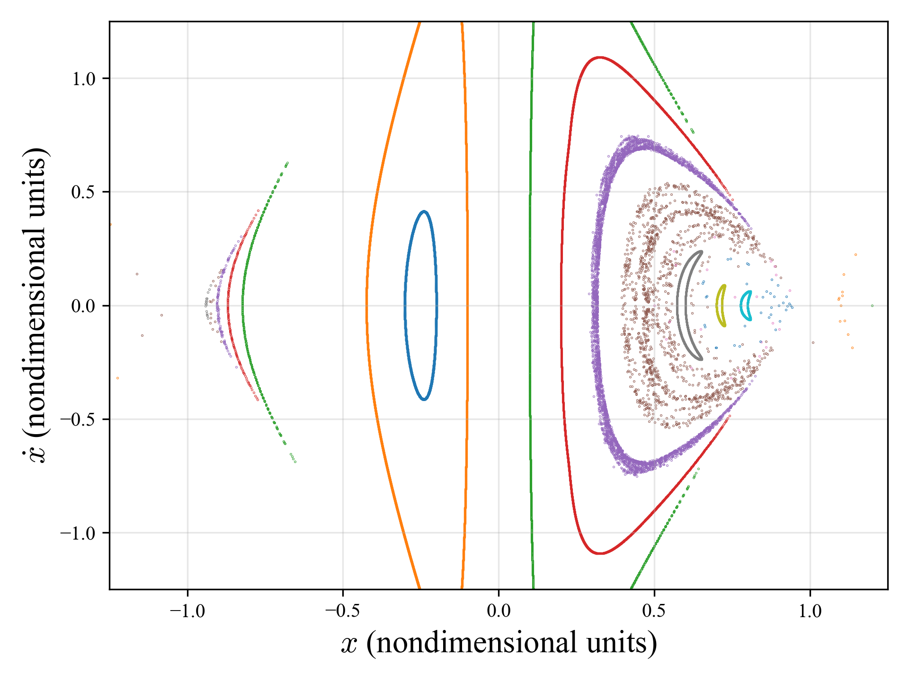
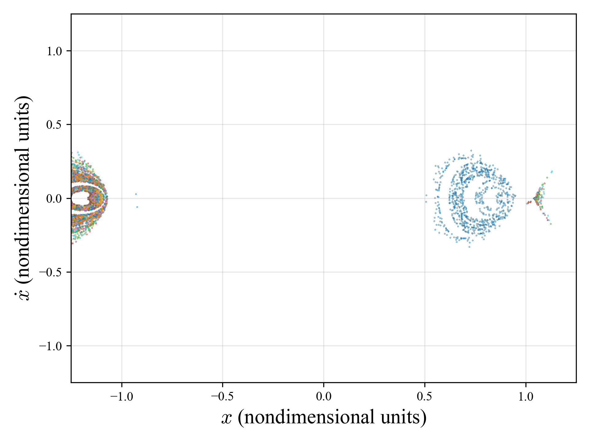

# Neptune–Triton CR3BP + J₂ 🌌🪐

[](#)
[](#)
[](LICENSE)


[](https://github.com/blaketjohnson)

Numerical experiments in the **Circular Restricted Three-Body Problem (CR3BP)** applied to the **Neptune–Triton system**.  
Implements both **classical CR3BP** and an extended model with **Neptune’s J₂ oblateness perturbation**, producing Poincaré maps, stability regions, and trajectory analyses.

---

## ✨ Highlights for Recruiters
- Implements both **classical CR3BP** and **J₂-perturbed CR3BP**.  
- Automated **Jacobi constant calculator** and **root solvers** for L1–L3.  
- Batch generation of **Poincaré surfaces of section** with multiprocessing.  
- **High-resolution plots** show stability islands and oblateness effects.  
- Modular structure: equations, rootfinding, Poincaré handlers, utilities.  

This repository demonstrates advanced skills in **orbital mechanics, numerical methods, high-precision integration, and dynamical systems analysis.**

---

## 📊 Example Results

### Classical CR3BP Surface of Section
<p align="center">
  
</p>

### CR3BP + J₂ Perturbation
<p align="center">
  
</p>

---

## 🚀 Quick Start

Clone the repo and install dependencies:
```bash
git clone https://github.com/blaketjohnson/r3bp_neptune_triton.git
cd r3bp_neptune_triton
pip install -r requirements.txt
```

Run a sample Poincaré map:
```bash
python scripts/run_poincare.py
```

Solve for Jacobi constants:
```bash
python scripts/jacobi_solver.py
```

---

## 🛠️ Dependencies
- Python 3.10+
- NumPy
- SciPy
- Matplotlib
- PyTest (optional)

Install all requirements with:
```bash
pip install -r requirements.txt
```

---

## 📂 Repository Structure
```
r3bp_neptune_triton/
├── src/
│   ├── equations/       # CR3BP and J₂ equations of motion
│   ├── rootfinding/     # L1–L3 solvers
│   ├── poincare/        # Poincaré event handlers + plotting
│   └── utils/           # constants, scaling, wrappers
├── scripts/
│   ├── run_poincare.py  # generate a Poincaré map
│   ├── jacobi_solver.py # compute Jacobi constants
│   └── plot_utils.py
├── docs/                # sample plots, slides, PDFs
├── tests/               # unit tests for equations + event handling
└── README.md
```

---

## 📚 Background
This project builds on classical CR3BP methods and extends them with Neptune’s oblateness.  
It demonstrates **stability region analysis, dynamical astronomy methods, and spacecraft trajectory design techniques.**

---

## 📌 About the Author
This project is part of a portfolio in **orbital mechanics, mission design, and aerospace systems engineering**.  
More projects available at: [GitHub Portfolio](https://github.com/blaketjohnson)

---

## 📜 License
MIT License — see [LICENSE](LICENSE).
